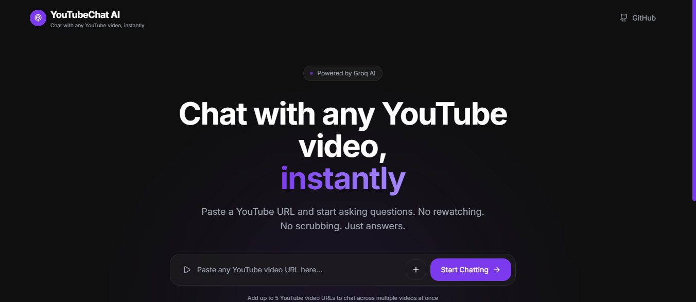
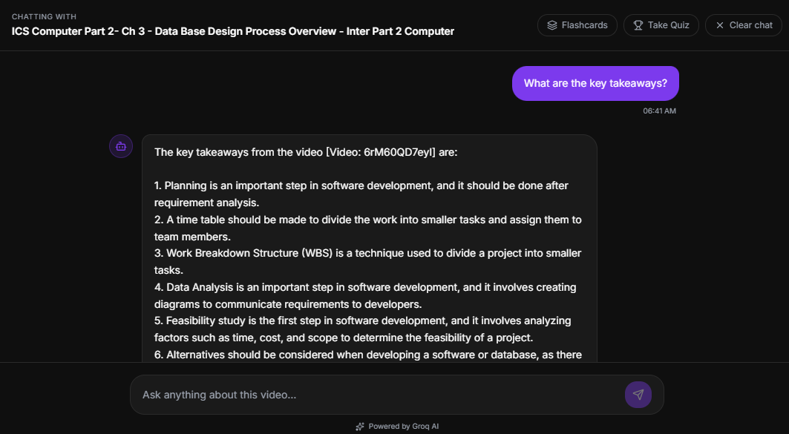
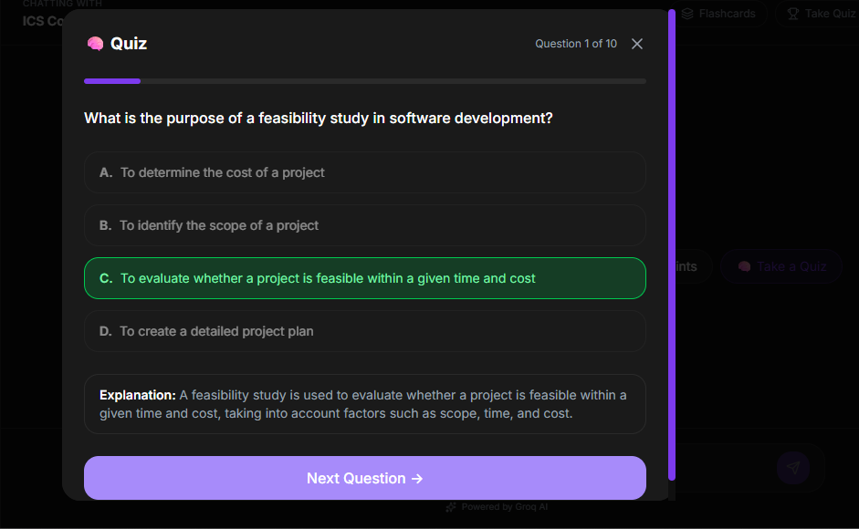

# YouTubeChat AI 🎥

> Turn any YouTube video into an AI you can talk to.


---

## 🚀 What is YouTubeChat AI?

YouTubeChat AI is a full-stack AI application that lets you chat with any YouTube video. Paste a URL, ask questions, generate MCQ quizzes, flashcards, and study notes — all powered by RAG (Retrieval Augmented Generation).

---

## ✨ Features

- 💬 **Chat with any YouTube video** — ask questions, get instant answers
- 🔗 **Multi-video support** — load up to 5 videos and chat across all of them
- 🧠 **MCQ Quiz generation** — auto-generate 10 exam-style questions with explanations
- 🃏 **Flashcards** — generate 15 flip-card flashcards for revision
- 📝 **Study Notes** — structured notes with key concepts and summary
- ⚡ **Hybrid Search** — BM25 keyword + semantic search for better retrieval
- 🎙️ **Whisper fallback** — transcribes videos without captions using Groq Whisper
- 🌊 **Streaming responses** — real-time word-by-word answers like ChatGPT

---

## 🛠️ Tech Stack

### Backend
| Tool | Purpose |
|---|---|
| FastAPI | REST API with streaming |
| LangChain | RAG pipeline orchestration |
| Groq (llama-3.3-70b) | LLM for answers, MCQs, flashcards |
| Groq Whisper | Audio transcription fallback |
| FAISS | Vector store for semantic search |
| Nomic Embeddings | Text embeddings |
| BM25 | Keyword search |
| youtube-transcript-api | YouTube transcript fetching |
| yt-dlp | Audio downloading |

### Frontend
| Tool | Purpose |
|---|---|
| React + TypeScript | UI framework |
| TailwindCSS | Styling |
| TanStack Router | Routing |
| Lucide React | Icons |

---

## 📁 Project Structure

```
ytChatbot/
├── api.py              # FastAPI backend
├── pipeline.py         # RAG pipeline
├── test.py             # CLI testing
├── requirements.txt    # Python dependencies
├── .env                # API keys
├── cookies.txt         # YouTube cookies
└── frontend/           # React frontend
    └── src/
        └── routes/
            └── index.tsx
```

---

## ⚙️ Setup & Installation

### Prerequisites
- Python 3.11+
- Node.js 18+
- Groq API key → [console.groq.com](https://console.groq.com)
- Nomic API key → [atlas.nomic.ai](https://atlas.nomic.ai)

### 1. Clone the repo
```bash
git clone https://github.com/mariumijay/ytChatbot.git
cd ytChatbot
```

### 2. Create virtual environment
```bash
conda create -n ytchatbot python=3.11
conda activate ytchatbot
```

### 3. Install dependencies
```bash
pip install -r requirements.txt
```

### 4. Set up environment variables
Create a `.env` file:
```
GROQ_API_KEY=your_groq_api_key
NOMIC_API_KEY=your_nomic_api_key
```

### 5. Set up YouTube cookies (to avoid IP blocks)
- Install "Get cookies.txt LOCALLY" Chrome extension
- Go to youtube.com while logged in
- Export cookies → save as `cookies.txt` in project root

### 6. Run the backend
```bash
uvicorn api:app --reload
```
API docs available at: **http://localhost:8000/docs**

### 7. Run the frontend
```bash
cd frontend
npm install
npm run dev
```
Frontend available at: **http://localhost:5173**

---

## 🔌 API Endpoints

| Method | Endpoint | Description |
|---|---|---|
| GET | `/health` | Check API status |
| GET | `/status` | Show loaded videos |
| POST | `/load` | Load single YouTube video |
| POST | `/load-multi` | Load multiple videos (max 5) |
| POST | `/chat` | Chat with streaming response |
| POST | `/notes` | Generate study notes |
| POST | `/mcq` | Generate 10 MCQ questions |
| POST | `/flashcards` | Generate 15 flashcards |
| DELETE | `/reset` | Clear session |

---

## 🧠 How it Works

```
YouTube URL
    ↓
Fetch transcript (youtube-transcript-api)
    ↓ (fallback)
Download audio (yt-dlp) → Transcribe (Groq Whisper)
    ↓
Split into chunks (RecursiveCharacterTextSplitter)
    ↓
Embed chunks (Nomic text-embedding)
    ↓
Store in FAISS vector store
    ↓
User asks question
    ↓
Hybrid retrieval (BM25 + Semantic search)
    ↓
LLM generates answer (Groq llama-3.3-70b)
    ↓
Stream response to frontend
```

---

## 📸 Screenshots

### Landing Page


### Chat Interface


### MCQ Quiz


### Flashcards


---

## 🗺️ Roadmap

- [x] Chat with single video
- [x] Multi-video support
- [x] Hybrid search
- [x] MCQ generation
- [x] Flashcard generation
- [x] Study notes generation
- [x] Streaming responses
- [ ] Deploy backend (Railway)
- [ ] Deploy frontend (Vercel)
- [ ] Add authentication
- [ ] Save chat history

---

## 👨‍💻 Author

Built by **Marium Ijay**  
GitHub: [@mariumijay](https://github.com/mariumijay)

---

## 📄 License

MIT License
